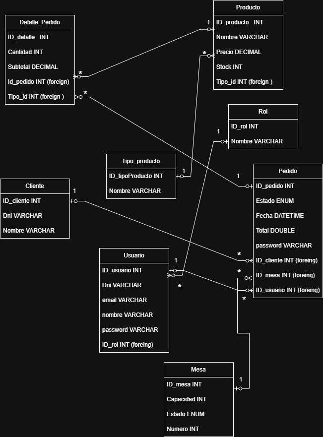
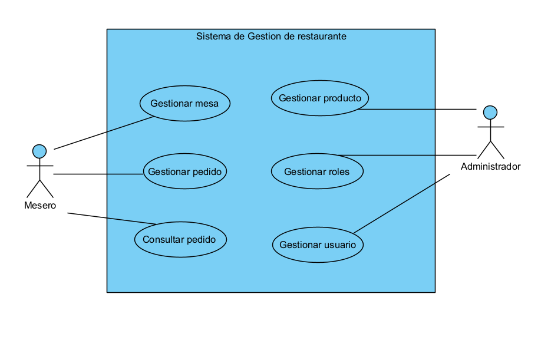

# 1. Caso de Negocio

El proyecto surge ante la necesidad de modernizar la gestión operativa de los restaurantes mediante el uso de tecnologías de software. En un entorno donde la rapidez en la atención, la organización interna y el control de la información son factores clave para la competitividad, resulta fundamental contar con herramientas que permitan optimizar estos procesos.

El sistema propuesto busca brindar una solución integral que permita gestionar de manera eficiente los pedidos, las mesas, los productos y los usuarios del restaurante, centralizando la información y facilitando su acceso en tiempo real. Asimismo, al incorporar el uso de tecnologías modernas y herramientas de desarrollo colaborativo, se promueve una solución escalable, mantenible y alineada con las prácticas actuales de la ingeniería de software.

De esta manera, el sistema no solo aporta valor operativo al negocio, sino que también contribuye a mejorar la calidad del servicio ofrecido, fortaleciendo la experiencia del cliente y apoyando la toma de decisiones dentro del restaurante.

---

# 2. Problema

En muchos restaurantes, los procesos relacionados con la gestión de pedidos, control de mesas e inventario se realizan de manera manual o mediante sistemas poco integrados, lo que genera ineficiencias en el funcionamiento del negocio. Esta situación ocasiona errores frecuentes en la toma de pedidos, dificultades en la organización del servicio y falta de control sobre la información generada.

Además, la carencia de un sistema centralizado limita la visibilidad de las operaciones en tiempo real, dificultando la coordinación entre el personal, como meseros, cocineros y administradores. Esto repercute directamente en la calidad del servicio, provocando retrasos, inconsistencias en los pedidos y una menor satisfacción del cliente.

Por otro lado, la ausencia de herramientas que permitan registrar y analizar la información impide obtener reportes confiables, lo que dificulta la toma de decisiones estratégicas dentro del negocio.

Ante esta problemática, se hace necesario implementar un sistema que permita automatizar y optimizar estos procesos, mejorando la organización, reduciendo errores y facilitando una gestión más eficiente del restaurante.

# 3. Requisitos

## 3.1 Requisitos Funcionales

- El sistema debe permitir gestionar pedidos (crear, editar, eliminar).
- El sistema debe permitir gestionar mesas.
- El sistema debe permitir administrar productos.
- El sistema debe permitir gestionar usuarios.
- El sistema debe permitir gestionar roles.
- El sistema debe permitir asociar pedidos a mesas y usuarios.
- El sistema debe permitir consultar pedidos.

---

## 3.2 Requisitos No Funcionales

- El sistema debe ser eficiente en el procesamiento de pedidos.
- El sistema debe garantizar disponibilidad durante su uso.
- El sistema debe ser fácil de usar.
- El sistema debe ser escalable para futuras mejoras.
- El sistema debe asegurar la integridad de los datos.

---

## 3.3 Restricciones Técnicas

- El sistema debe estar desarrollado utilizando Spring Boot.
- El sistema debe exponer servicios mediante arquitectura REST.
- El sistema debe utilizar JPA/Hibernate para la persistencia de datos.
- El sistema debe emplear una base de datos relacional.
- El sistema debe permitir la realización de pruebas básicas bajo el enfoque TDD.

---

## 3.4 Alcance del Sistema

### Funcionalidades No Incluidas

- No se incluye el desarrollo de una interfaz gráfica (frontend).
- No se incluye la implementación de autenticación y autorización avanzada (JWT, Spring Security).
- No se incluye lógica de negocio compleja como optimización de pedidos o control automático de inventario.
- No se incluye la generación de reportes o dashboards.
- No se incluyen integraciones externas ni notificaciones.

# 4. Diagramas

## 4.1 Diagrama Entidad-Relación (ER)

El presente diagrama entidad-relación representa la estructura de la base de datos del sistema de gestión de restaurante. En él se identifican las principales entidades, sus atributos y las relaciones que existen entre ellas, permitiendo modelar el funcionamiento del sistema de manera organizada.

En primer lugar, se observa la entidad Cliente, la cual almacena la información básica de los clientes, como su DNI y nombre. Esta entidad se relaciona con Pedido, ya que un cliente puede realizar uno o varios pedidos, estableciendo una relación de uno a muchos.

La entidad Pedido es central en el sistema, ya que registra la información de cada pedido realizado, incluyendo su estado, fecha y total. Además, se vincula con varias entidades: con Cliente, con Mesa (indicando en qué mesa se realizó el pedido) y con Usuario, que representa al mesero o empleado que atendió dicho pedido.

Por otro lado, la entidad Detalle_Pedido permite descomponer cada pedido en los productos específicos que lo conforman. Aquí se registra la cantidad y el subtotal de cada producto dentro del pedido. Esta entidad tiene una relación de muchos a uno tanto con Pedido como con Producto, ya que un pedido puede tener varios detalles y cada detalle corresponde a un producto específico.

La entidad Producto contiene la información de los productos disponibles en el restaurante, como nombre, precio y stock. Además, cada producto pertenece a un Tipo_producto, lo que permite clasificar los productos (por ejemplo, bebidas, platos, postres), estableciendo una relación de muchos a uno.

En cuanto a la gestión del personal, la entidad Usuario almacena los datos de los empleados del sistema, incluyendo credenciales de acceso. Cada usuario está asociado a un Rol, lo que define sus permisos dentro del sistema (por ejemplo, administrador o mesero), mediante una relación de muchos a uno.

Finalmente, la entidad Mesa representa las mesas del restaurante, incluyendo su capacidad, estado y número. Esta se relaciona con Pedido, ya que una mesa puede tener múltiples pedidos a lo largo del tiempo.

En conjunto, este modelo permite gestionar de manera eficiente la información del restaurante, facilitando el control de pedidos, productos, clientes y usuarios, así como las relaciones entre ellos.

## 4.2 Diagrama de Casos de Uso

## Actor: Mesero

### CUS01 - Registrar Pedido
**Descripción:**  
El mesero registra un nuevo pedido en el sistema, asociándolo a una mesa y a los productos solicitados.

**Flujo básico:**
1. El mesero ingresa al sistema.
2. Selecciona la opción registrar pedido.
3. Ingresa los datos del pedido (mesa, productos, cantidades).
4. El sistema guarda la información del pedido.

---

### CUS02 - Gestionar Mesa
**Descripción:**  
El mesero actualiza el estado de una mesa (libre u ocupada).

**Flujo básico:**
1. El mesero selecciona una mesa.
2. Modifica su estado.
3. El sistema actualiza la información.

---

### CUS03 - Gestionar Pedido
**Descripción:**  
El mesero puede actualizar información de un pedido, como modificar productos o cambiar su estado.

**Flujo básico:**
1. El mesero selecciona un pedido existente.
2. Realiza modificaciones.
3. El sistema guarda los cambios.

---

### CUS04 - Consultar Pedido
**Descripción:**  
El mesero visualiza los pedidos registrados en el sistema.

**Flujo básico:**
1. El mesero accede a la lista de pedidos.
2. El sistema muestra la información disponible.

---

## Actor: Administrador

### CUS05 - Gestionar Producto
**Descripción:**  
El administrador crea, actualiza o elimina productos del sistema.

**Flujo básico:**
1. El administrador accede al módulo de productos.
2. Realiza la acción (crear, editar o eliminar).
3. El sistema guarda los cambios.

---

### CUS06 - Gestionar Usuario
**Descripción:**  
El administrador administra los usuarios del sistema.

**Flujo básico:**
1. El administrador accede al módulo de usuarios.
2. Crea, edita o elimina usuarios.
3. El sistema guarda la información.

---

### CUS07 - Gestionar Rol
**Descripción:**  
El administrador asigna y modifica roles de usuario.

**Flujo básico:**
1. El administrador accede al módulo de roles.
2. Realiza modificaciones.
3. El sistema actualiza los datos.

---

### CUS08 - Consultar Pedido
**Descripción:**  
El administrador visualiza los pedidos registrados en el sistema.

**Flujo básico:**
1. El administrador accede a la lista de pedidos.
2. El sistema muestra la información.